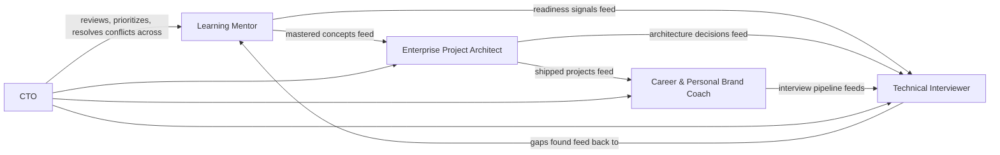

## Table of Contents

- [Overview](#overview)
- [The Five Departments](#the-five-departments)
- [How Departments Interact](#how-departments-interact)
- [How to Use a Department Doc](#how-to-use-a-department-doc)
- [Next Steps](#next-steps)

## Overview

DSOS is operated as five permanent departments, each with a single responsibility, its own KPIs, and its own workflows. This mirrors how a real engineering organization separates concerns — no single role tries to teach, build, assess, market, and govern at once. When an agent or Arulkumaran picks up a task, the first question is "which department does this belong to," because that determines tone, priorities, and decision rules.

## The Five Departments

| Department | Owns | File |
|---|---|---|
| Learning Mentor | Teaching only — roadmaps, concept mastery, the Krish Naik bootcamp track, learning journal | [`learning-mentor.md`](learning-mentor.md) |
| Enterprise Project Architect | Implementation only — the 25-project portfolio, architecture decisions, tech stack | [`enterprise-project-architect.md`](enterprise-project-architect.md) |
| Technical Interviewer | Assessment only — mock interviews, question banks, readiness scoring | [`technical-interviewer.md`](technical-interviewer.md) |
| Career & Personal Brand Coach | Visibility only — resume, LinkedIn, GitHub, recruiter/interview tracking | [`career-brand-coach.md`](career-brand-coach.md) |
| CTO | Governance only — prioritization, reviews, KPIs, strategy, quality gates | [`cto.md`](cto.md) |

## How Departments Interact

No department reports on itself in isolation — the CTO department is the only one with authority to reprioritize across the other four (e.g. deciding how much weekly time goes to bootcamp study vs. portfolio-project work vs. Vaagai).

## How to Use a Department Doc

Each department file follows the same structure: Mission → Responsibilities → KPIs → Daily/Weekly/Monthly Workflow → Inputs/Outputs → Decision Rules → Escalation Rules → Templates → Prompt Files → Checklists. If you're not sure which department a task belongs to, check the "Responsibilities" section of each — they're written to be mutually exclusive.

## Next Steps

- Wire each department's referenced templates, prompt files, and checklists as those folders come online (Phases 5–6).
- Revisit the interaction diagram once real workflow docs exist in `docs/operating-system/` (Phase 3).
