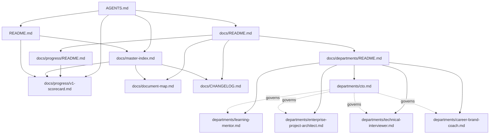

## Table of Contents

- [Overview](#overview)
- [Current Map](#current-map)
- [Reading the Map](#reading-the-map)
- [Next Steps](#next-steps)

## Overview

`docs/master-index.md` is the flat, complete list of every document. This file is the visual, relationship-focused companion — useful once the repo has enough documents that "how does X connect to Y" stops being obvious from the index alone. Below ~10 documents this map is close to trivial; it's kept from day one so the habit of updating it is established early.

## Current Map

## Reading the Map

- An arrow means "the source document links to / depends on the target."
- `AGENTS.md` is the root of the governance layer — nearly everything traces back to it.
- As `docs/departments/`, `docs/engineering-standards/`, etc. come online in later phases, they'll attach here as new subgraphs rather than flattening into one diagram — split into per-module Mermaid blocks if the single graph gets hard to read (rough threshold: ~25 nodes).

## Next Steps

- Add a subgraph for `resources/` (glossary, abbreviation guide) once expanded.
- Add a subgraph for `docs/operating-system/` once created (Phase 3).
- Revisit the "split into per-module diagrams" threshold once real project and prompt-library nodes are added (Phases 5–7).
