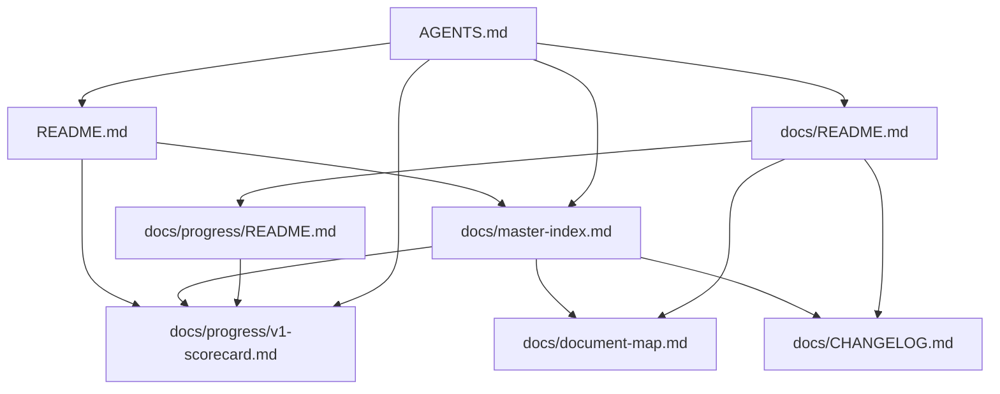
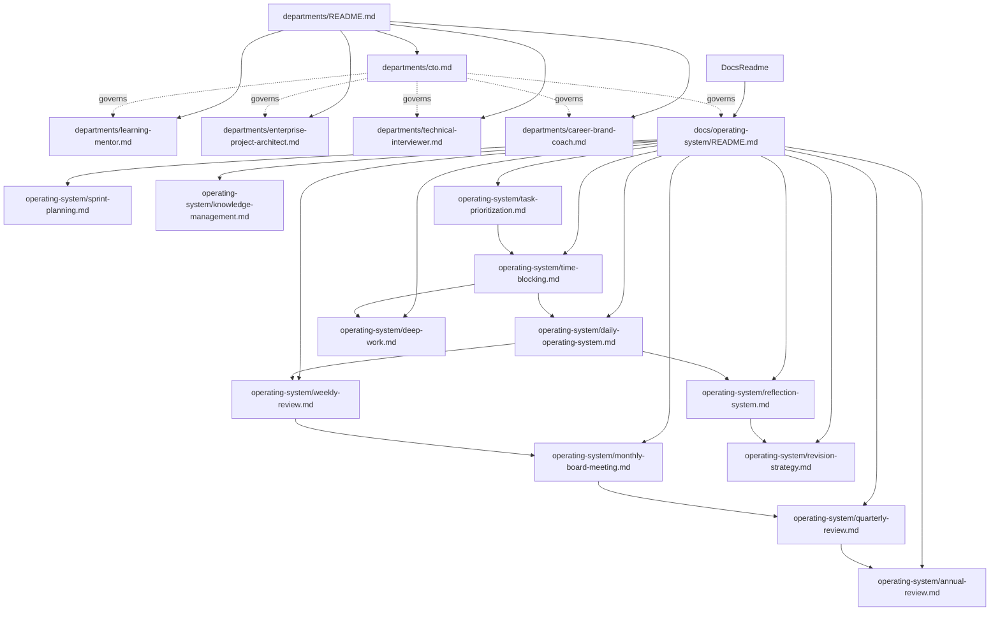
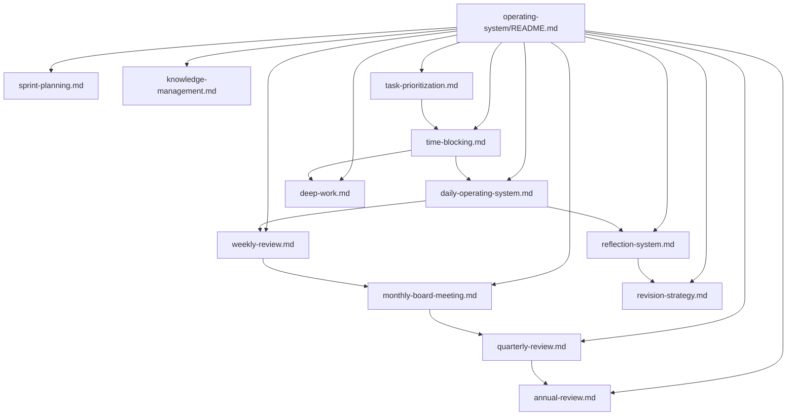
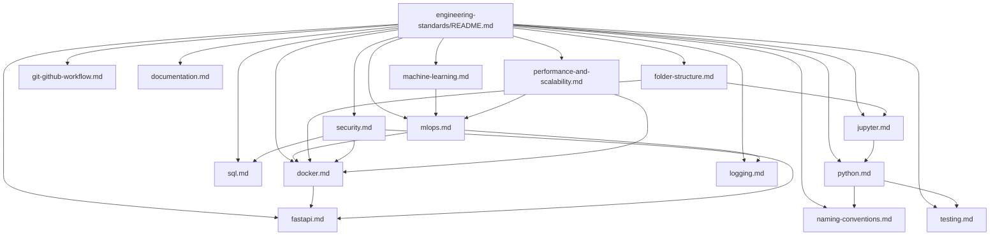
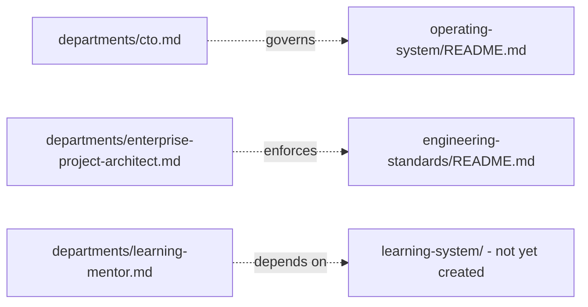

## Table of Contents

- [Overview](#overview)
- [Current Map](#current-map)
- [Reading the Map](#reading-the-map)
- [Next Steps](#next-steps)

## Overview

`docs/master-index.md` is the flat, complete list of every document. This file is the visual, relationship-focused companion — useful once the repo has enough documents that "how does X connect to Y" stops being obvious from the index alone. Below ~10 documents this map is close to trivial; it's kept from day one so the habit of updating it is established early.

## Current Map

The map now spans four modules (Foundation, Departments, Operating System, Engineering Standards) and exceeded the ~25-node single-graph threshold — split into per-module diagrams below, per the rule stated in "Reading the Map."

### Foundation

### Departments

### Operating System

*(The CTO department governs this whole module — see the cross-module link below.)*

### Engineering Standards

### Cross-Module Links

## Reading the Map

- An arrow means "the source document links to / depends on the target."
- `AGENTS.md` is the root of the governance layer — nearly everything traces back to it, even where not drawn explicitly in every subgraph.
- Diagrams are split per module now that the repo exceeds ~25 nodes total. Each new module (Templates, Prompt Library, Project Library, Career System) gets its own diagram below rather than growing an existing one past readability.

## Next Steps

- Add a subgraph for `resources/` (glossary, abbreviation guide) once expanded.

- Add a diagram for `docs/learning-system/`, `docs/career-system/` once those are created (deferred — not part of the original 10-phase roadmap's explicit folder list, revisit if department docs' forward-references to them turn into real content).
- Add diagrams for Templates, Prompt Library, and Project Library as Phases 5–7 complete.
=======
- This map now has ~30 nodes — approaching the split threshold noted below. Revisit splitting into per-module diagrams once `docs/engineering-standards/` (Phase 4) adds another cluster.
- Revisit the "split into per-module diagrams" threshold (~25 nodes) once real project and prompt-library nodes are added (Phases 5–7).
