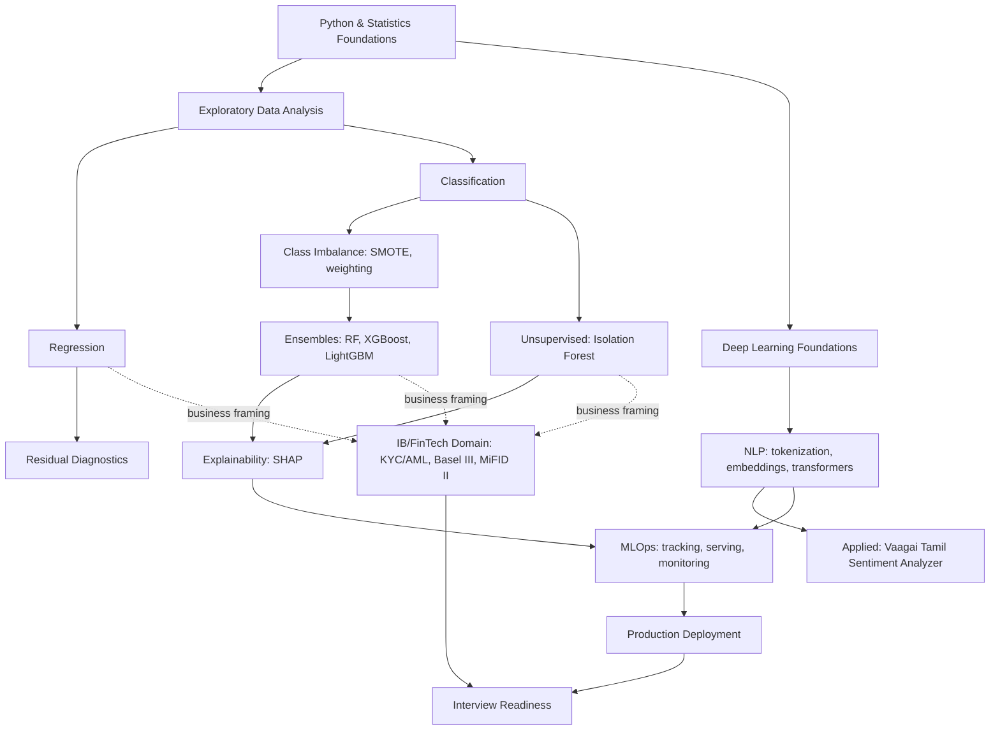

## Table of Contents

- [Overview](#overview)
- [The Map](#the-map)
- [How to Use This](#how-to-use-this)
- [References](#references)
- [Next Steps](#next-steps)

## Overview

`templates/concept-map-template.md` produces a per-phase concept map (e.g. how this week's 3 topics relate). This document is the one level up — how the entire domain fits together, so a new concept always has a place to attach to rather than floating disconnected.

## The Map

## How to Use This

When a new concept doesn't obviously connect to anything, check this map first — most genuinely new ML/DS concepts are a variant or extension of something already on here, not a disconnected island. If something truly doesn't fit, that's worth a note to the Learning Mentor about whether the map itself needs an update, not just the roadmap.

## References

- `docs/learning-system/roadmap.md` — the phase sequence this map underlies
- `templates/concept-map-template.md` — the per-phase, finer-grained version of this idea

## Next Steps

- Extend this map as Phase 4 (Deep Learning) and Phase 5 (NLP) progress and reveal which sub-branches actually matter most in practice.
