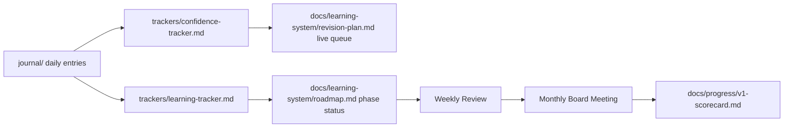

## Table of Contents

- [Overview](#overview)
- [The Roll-Up Chain](#the-roll-up-chain)
- [What Each Layer Owns](#what-each-layer-owns)
- [Decision Rules](#decision-rules)
- [References](#references)

## Overview

No single tracker tells the whole story — this document is how they connect, so nothing gets double-counted or silently dropped between a daily journal entry and a Monthly Board Meeting report.

## The Roll-Up Chain

## What Each Layer Owns

| Layer | Owns |
|---|---|
| `journal/` | Raw, dated, per-session facts |
| `trackers/confidence-tracker.md` | Per-concept confidence trend over time |
| `trackers/learning-tracker.md` | Per-phase completion status |
| `docs/learning-system/roadmap.md` | The authoritative current phase status |
| Weekly Review / Monthly Board Meeting | Aggregation and decision-making |
| `docs/progress/v1-scorecard.md` | Repo-wide status, not learning-specific detail |

## Decision Rules

- The roadmap's phase status is the single source of truth for "what phase are we in" — trackers feed it, but don't override it independently.
- If a tracker and the roadmap disagree, that's a reconciliation task for the next Weekly Review, not something to silently resolve by picking whichever number looks better (the same principle `docs/progress/v1-hardening-report.md` applied to the repo-wide scorecard).

## References

- `trackers/learning-tracker.md`, `confidence-tracker.md`
- `docs/learning-system/roadmap.md`
- `docs/progress/v1-hardening-report.md` — the precedent for honest reconciliation over convenient numbers
