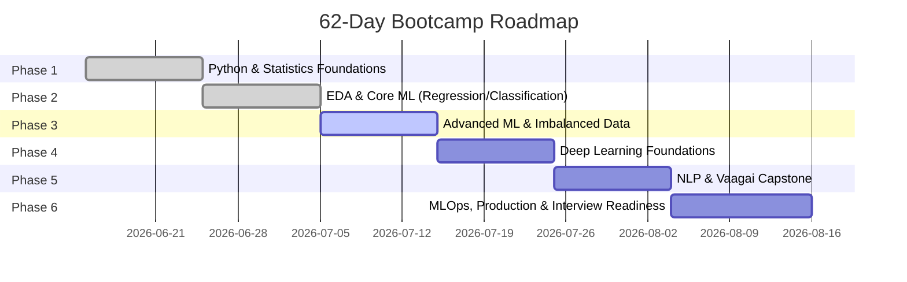

## Table of Contents

- [Overview](#overview)
- [A Note on This Document's Origin](#a-note-on-this-documents-origin)
- [The Six Phases](#the-six-phases)
- [Phase Detail](#phase-detail)
- [Vaagai Capstone Integration](#vaagai-capstone-integration)
- [Interview Readiness Checkpoint](#interview-readiness-checkpoint)
- [Checklist](#checklist)
- [References](#references)
- [Next Steps](#next-steps)

## Overview

62 days (June 15 – August 15, 2026), six phases, structured around evening study sessions (Mon/Wed/Fri) and Sunday deep-dive blocks, per `docs/operating-system/time-blocking.md`. This is the roadmap `playbooks/learning-new-topic.md` checks before every study session.

## A Note on This Document's Origin

This roadmap reconstructs the six-phase structure already established for the bootcamp study plan, built around what's independently known to be true: the diagnostic-informed starting point (Python fundamentals — iterators/generators), the sprint sessions already completed (Logistic Regression with threshold-shifting, Linear Regression with residual diagnostics), the completed car insurance claim prediction project, and the Aug 15 target date. The specific day-by-day topic sequencing within each phase is a reasonable reconstruction consistent with a standard DS/ML/DL/NLP curriculum shape, not a verbatim transcription of the Udemy platform's own module list — cross-check against the actual course dashboard if a specific day's exact topic needs to match precisely.

## The Six Phases

| Phase | Dates | Status |
|---|---|---|
| 1. Python & Statistics Foundations | Jun 15 – Jun 24 | **Complete** |
| 2. EDA & Core ML (Regression/Classification) | Jun 25 – Jul 4 | **Complete** |
| 3. Advanced ML & Imbalanced Data | Jul 5 – Jul 14 | **In Progress** |
| 4. Deep Learning Foundations | Jul 15 – Jul 24 | Not started |
| 5. NLP & Vaagai Capstone | Jul 25 – Aug 3 | Not started |
| 6. MLOps, Production & Interview Readiness | Aug 4 – Aug 15 | Not started |

## Phase Detail

### Phase 1 — Python & Statistics Foundations (Complete)

Diagnostic-informed starting point: began at Python fundamentals (iterators, generators) rather than absolute basics, based on prior QA automation Python experience. Covered: iterators/generators, comprehensions, `pandas`/`numpy` fundamentals, descriptive statistics, probability distributions, hypothesis testing fundamentals.

### Phase 2 — EDA & Core ML (Regression/Classification) (Complete)

Covered exploratory data analysis patterns, then core supervised learning: Linear Regression with full residual diagnostic analysis (heteroscedasticity, normality, leverage points — completed as a dedicated sprint session), Logistic Regression with threshold-shifting as a business lever (completed as a dedicated sprint session, framed around a synthetic loan dataset with ~15% default rate). Capstone for this phase: the completed Car Insurance Claim Prediction project (Project 01), which benchmarked five modeling strategies and honestly reported a ROC-AUC ceiling of ~0.65.

### Phase 3 — Advanced ML & Imbalanced Data (In Progress)

Class imbalance techniques (SMOTE, class weighting), ensemble methods (Random Forest, XGBoost, LightGBM), unsupervised anomaly detection (Isolation Forest), and model explainability (SHAP). This phase directly feeds Projects 02 (Credit Card Fraud Detection) and 10 (AML Transaction Monitoring).

### Phase 4 — Deep Learning Foundations (Not Started)

Neural network fundamentals, backpropagation intuition, CNNs for structured pattern recognition, an introduction to sequence models — enough depth to be conversant in DL without over-rotating away from the tabular-data ML strength that's the portfolio's real differentiator.

### Phase 5 — NLP & Vaagai Capstone (Not Started)

NLP fundamentals (tokenization, embeddings, transformer basics), applied directly to the Vaagai capstone deliverable: a Tamil sentiment analyzer and anomaly detection component for the Vaagai platform. This is the one phase explicitly designed to produce a Vaagai deliverable, not just a portfolio project — see [Vaagai Capstone Integration](#vaagai-capstone-integration) below.

### Phase 6 — MLOps, Production & Interview Readiness (Not Started)

Final stretch to Aug 15: MLOps practices (already detailed in `docs/engineering-standards/mlops.md`), heavier mock-interview cadence (per `docs/departments/technical-interviewer.md`), and closing out any remaining project implementation gaps flagged in `docs/progress/v1-hardening-report.md`.

## Vaagai Capstone Integration

Phase 5 is the deliberate integration point between the bootcamp and the Vaagai venture — a Tamil sentiment analyzer and anomaly detection component, built with bootcamp-fresh NLP skills, doubles as a real Vaagai feature rather than a throwaway exercise. This is the only phase where Vaagai work happens outside its normal Sunday-reserve-only allocation (per `docs/operating-system/task-prioritization.md`) — a deliberate, temporary exception because the same work serves both the bootcamp and the venture simultaneously.

## Interview Readiness Checkpoint

Phase 6's timing is not incidental — it's the final 12 days before the Aug 15 target, reserved for consolidation and assessment rather than new material, per `docs/operating-system/revision-strategy.md`'s principle that new-topic learning stops before a deadline in favor of revision and mock-interview repetition.

## Checklist

- [ ] Phase status updated here at every phase transition
- [ ] Each phase's capstone/project deliverable identified before the phase starts, not after
- [ ] Phase 6 timing protected — no new-topic learning scheduled inside it

## References

- `docs/departments/learning-mentor.md` — owns this roadmap's execution
- `docs/operating-system/revision-strategy.md` — phase-transition revision passes
- `projects/README.md` — Projects 01, 02, 10 referenced above

## Next Steps

- Update Phase 3's status and detail as it completes.
- Confirm Phase 5's Vaagai deliverable scope against `docs/operating-system/task-prioritization.md`'s CTO-level exception rule before starting it.
