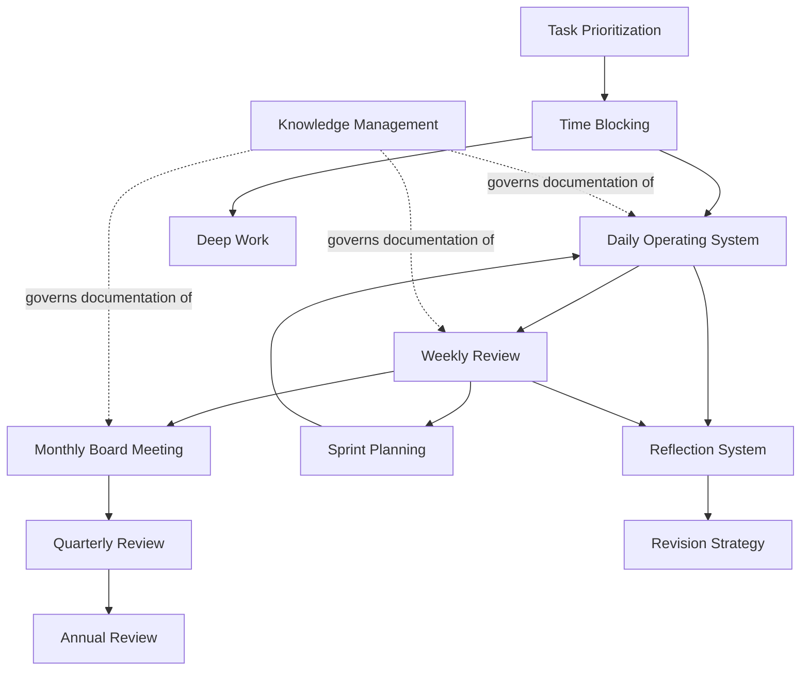

## Table of Contents

- [Overview](#overview)
- [The Eleven Documents](#the-eleven-documents)
- [How the Cadence Fits Together](#how-the-cadence-fits-together)
- [Constraints This System Is Designed Around](#constraints-this-system-is-designed-around)
- [Next Steps](#next-steps)

## Overview

The Operating System is the layer that turns the five departments (Section 4) into a repeatable rhythm — what happens every day, every week, every month, every quarter, every year, and how work gets prioritized, blocked, deep-focused, revised, and reflected on in between. Departments define *who* is responsible for *what*; the Operating System defines *when* and *how often* that work happens.

## The Eleven Documents

| Cadence / System | File | Owned primarily by |
|---|---|---|
| Daily Operating System | [`daily-operating-system.md`](daily-operating-system.md) | All departments |
| Weekly Review | [`weekly-review.md`](weekly-review.md) | CTO |
| Monthly Board Meeting | [`monthly-board-meeting.md`](monthly-board-meeting.md) | CTO |
| Quarterly Review | [`quarterly-review.md`](quarterly-review.md) | CTO |
| Annual Review | [`annual-review.md`](annual-review.md) | CTO |
| Sprint Planning | [`sprint-planning.md`](sprint-planning.md) | CTO + Enterprise Project Architect |
| Knowledge Management | [`knowledge-management.md`](knowledge-management.md) | CTO (enforced by all) |
| Task Prioritization | [`task-prioritization.md`](task-prioritization.md) | CTO |
| Time Blocking | [`time-blocking.md`](time-blocking.md) | All departments |
| Deep Work | [`deep-work.md`](deep-work.md) | Learning Mentor + Enterprise Project Architect |
| Revision Strategy | [`revision-strategy.md`](revision-strategy.md) | Learning Mentor |
| Reflection System | [`reflection-system.md`](reflection-system.md) | All departments |

## How the Cadence Fits Together

## Constraints This System Is Designed Around

- **Fixed full-time job:** Synechron, Morgan Stanley domain QA automation work — daytime hours are not available for DSOS/bootcamp/Vaagai.
- **Study windows:** evenings (weekdays) and Sundays (deep-dive), per the Krish Naik bootcamp study plan.
- **Hard deadline:** interview readiness by August 15, 2026.
- **Parallel venture:** Vaagai (Tamil-first AI elder care platform) competes for the same evening/weekend time and is explicitly a CTO-department prioritization call, not something each document decides independently.

## Next Steps

- Populate each document's templates once `templates/` exists (Phase 5).
- Run the first real Weekly Review once at least one full week of department activity has been logged.
