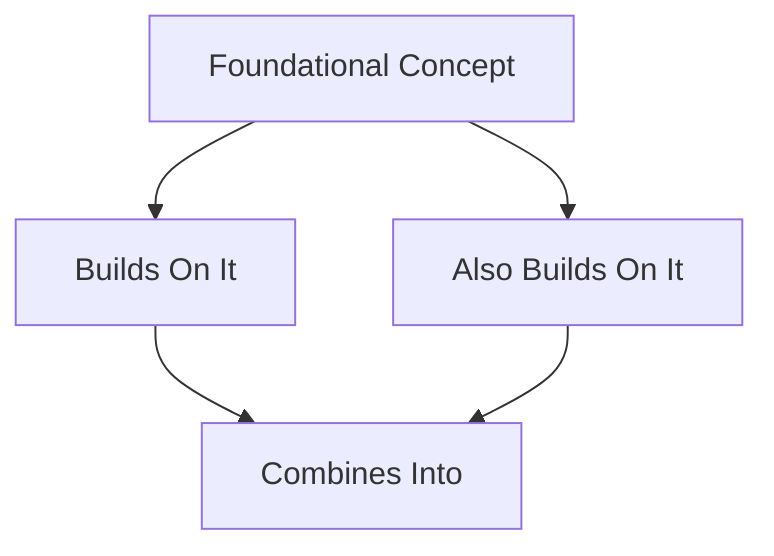

# Concept Map: [Phase Name]

```mermaid
graph TD
    A[Foundational Concept] --> B[Builds On It]
    A --> C[Also Builds On It]
    B --> D[Combines Into]
    C --> D
```

## Notes
[Any concept whose position in the map isn't obvious]
